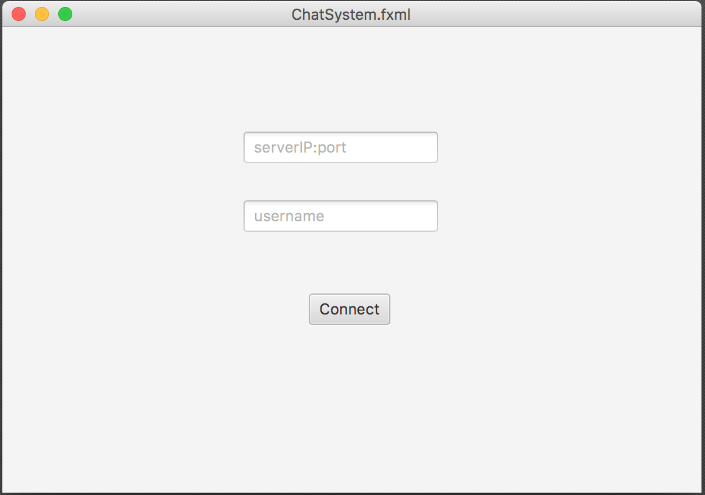

# ChatAppSWC3
Chat Application for the Software Construction subject.

## Screenshots

  

## Deployment
Build and run ServerMain.class, package server.
copy from the console the ip/port address for the server side of the chat system
Build and run Main.class, package client.
enter the ip/port and a username. Username must be max 12 chars long, only letters, digits, ‘-‘ and ‘_’ allowed.
Enjoy some chatting with your friends, good for when there is no other alternative.
